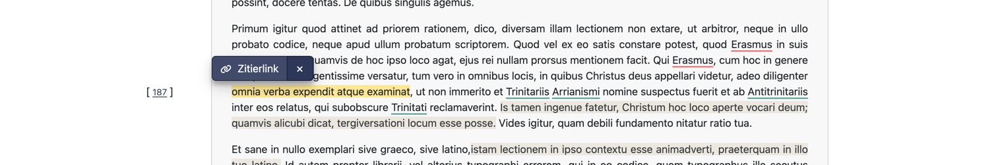

# Digitales Zitieren

In der digitalen Wissenschaft und Forschung spielt das präzise Zitieren eine entscheidende Rolle. 
Anders als bei gedruckten Publikationen stellt das Zitieren digitaler Inhalte besondere Anforderungen: Digitale Texte sind oft dynamisch. 
Daher braucht es Methoden, die es ermöglichen, genaue Verweise auf spezifische Textstellen in digitalen Dokumenten zu erstellen.

Eine mögliche Technik für digitales Zitieren entspricht dem Arbeiten mit Start- und Endindizes, die die exakten Positionen der zu zitierenden 
Textstellen markieren. Diese Methode eignet sich besonders für digitale Editionen, die in ihrer Struktur festgelegt sind und nicht mehr verändert werden. 
Mit dieser Methode lassen sich Textstellen eindeutig und wiederholbar referenzieren und somit wissenschaftlich genau zitieren.

Die Zitierfunktion befindet sich in der Beta-Phase.

## Zitierprozess: Schritt-für-Schritt-Anleitung

Abbildung 1: Screenshot der Funktion “Zitierlink” in der digitalen Edition “Die sozinianischen Briefwechsel”, der das Erstellen von dauerhaften Verweisen auf spezifische Textstellen zeigt.

1. **Text markieren:** Zunächst den zu zitierenden Textabschnitt auswählen, der referenziert werden soll.
2. **Zitierfunktion verwenden:** Die Zitierfunktion (meist „Zitieren“ oder „Zitierlink“ genannt) verwenden, die speziell für diese Art zur Verfügung steht und in Abbildung 1 dargestellt ist.
3. **Start- und Endindex erzeugen:** Das System erstellt automatisch einen Link, der Start- und Endindizes für den markierten Text enthält. Diese Indizes markieren exakt die Anfangs- und Endposition des Zitats im Text, die nachträglich noch bearbeitet und angepasst werden können.

Ein solcher Zitierlink könnte beispielsweise wie folgt aussehen: 

https://www.sozinianer.de/id/MAIN_wlw_qlm_zdb?guid=wlw_qlm_zdb&s=1445&e=1479

Hierbei steht `&s=1445` für den Startindex und `&e=1479` für den Endindex des Zitats, `?guid=wlw_qlm_zdb` verweist auf die Quelle.
